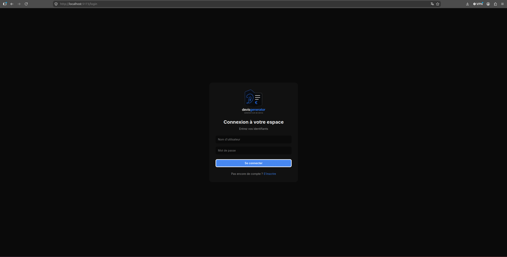
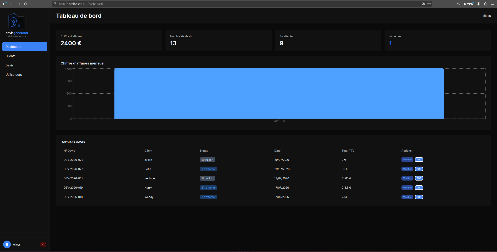
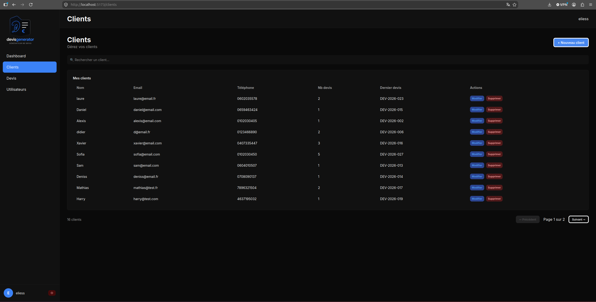
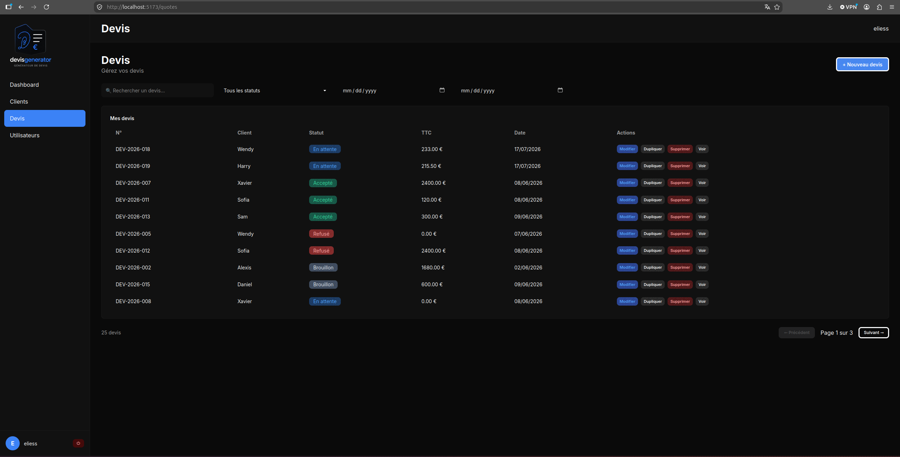
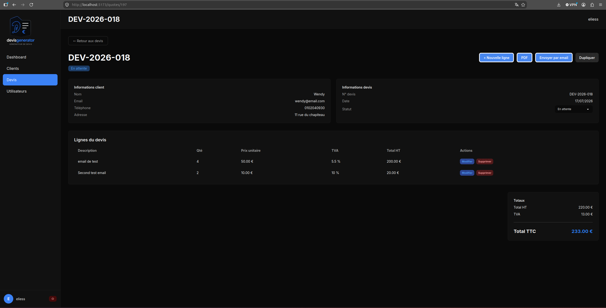
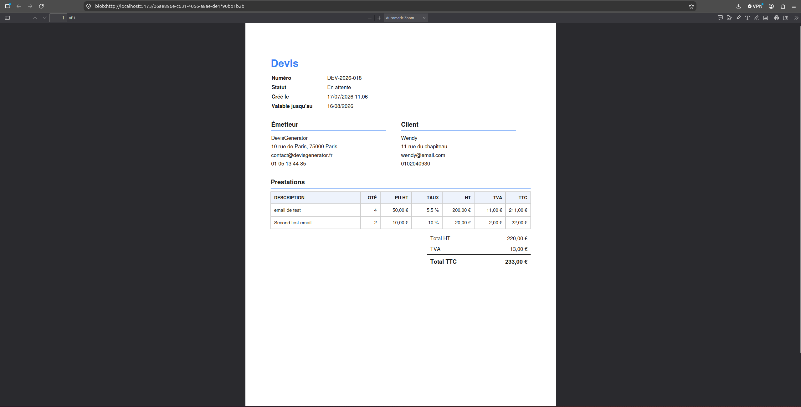
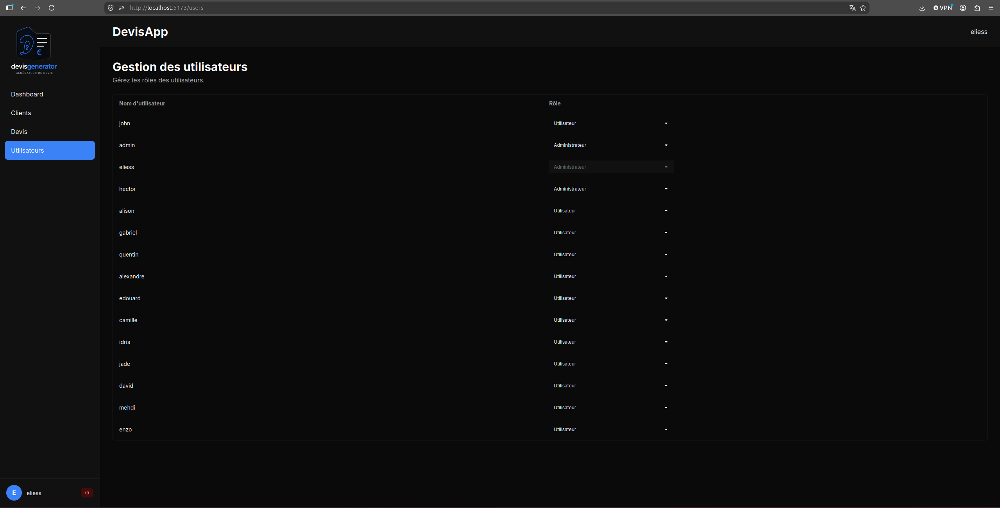

# Générateur de Devis

Application de gestion commerciale permettant de créer, personnaliser et envoyer des devis professionnels, avec suivi des clients et export PDF.
Projet personnel réalisé pour approfondir le développement full-stack avec Spring Boot et React, dans un contexte proche des conditions d'un projet professionnel.

[](https://github.com/Eliess-hue/devisgeneratorproject/actions/workflows/ci.yml)

🔗 **[Démo en ligne](https://devisgeneratorproject.vercel.app)**

## Aperçu

| Connexion | Tableau de bord | Clients |
|:---:|:---:|:---:|
|  |  |  |

| Liste des devis | Détail d'un devis | Export PDF |
|:---:|:---:|:---:|
|  |  |  |

| Gestion des utilisateurs |
|:---:|
|  |

## Fonctionnalités principales
* **Authentification & rôles** — inscription/connexion sécurisées par JWT, avec distinction utilisateur / administrateur
* **Gestion des clients** — création, recherche filtrée et paginée, modification et suppression
* **Gestion des devis** — création de devis avec lignes détaillées, duplication rapide, recherche filtrée et paginée
* **Export & envoi** — génération du devis en PDF et envoi direct par e-mail au client
* **Tableau de bord** — vue d'ensemble de l'activité commerciale

## Stack technique
### Backend
* **Java 21**
* **Spring Boot 3.5.1**
* **Spring Data JPA** / **PostgreSQL**
* **Flyway** — gestion des migrations de base de données
* **Spring Security / JWT** — authentification par jeton
* **Spring Boot Actuator** — supervision et informations sur l'application
* **Swagger UI / OpenAPI** — documentation et exploration de l'API
* **Thymeleaf** + **openhtmltopdf** — génération des devis au format PDF
* **Spring Mail** — envoi d'e-mails (SMTP/Mailtrap en développement, Brevo en production)

### Frontend
* **React 19**
* **Vite**
* **React Router** — navigation entre les différentes vues
* **Axios** — communication avec l'API
* **Recharts** — visualisation des données du tableau de bord
* **Tailwind CSS** + **daisyUI** — conception et mise en forme de l'interface

### Infrastructure
* **Docker**
* **Docker Compose**

## Architecture

### Flux applicatif

┌────────────┐ HTTP ┌─────────────┐ ┌────────────┐
│ Frontend │ ───────────────→ │ Backend │ ───→ │ PostgreSQL │
│ React 19 │ ←─────────────── │ Spring Boot │ ←─── │ │
│ (Vercel) │ │ (Render) │ │ (Render) │
└────────────┘ └─────────────┘ └────────────┘

### Flux de déploiement

┌──────────┐ ┌────────────────┐ ┌──────────────┐
│ GitHub │ → │ GitHub Actions │ ──┬──→ │ Render │
└──────────┘ └────────────────┘ │ │ (Backend) │
│ └──────────────┘
│ ┌──────────────┐
└──→ │ Vercel │
│ (Frontend) │
└──────────────┘

## Lancer le projet en local

### Prérequis
* Git
* Docker
* Docker Compose

### Configuration
Copier le fichier d'exemple :
```bash
cp .env.example .env
```

Renseigner les variables d'environnement dans `.env` (voir [.env.example](.env.example) pour le détail).

### Démarrage
Depuis la racine du projet :
```bash
docker compose up --build
```

Une fois les conteneurs démarrés :
* Frontend : `http://localhost`
* Backend : `http://localhost:8080` *(non exposé publiquement par défaut, accessible via le réseau Docker interne)*

## Documentation & liens utiles
- 📘 [Documentation API (Swagger)](http://localhost:8080/swagger-ui.html) — une fois le backend lancé
- 📄 [README Backend](devisgenerator/README.md)
- 📄 [README Frontend](devisgenerator-frontend/README.md)